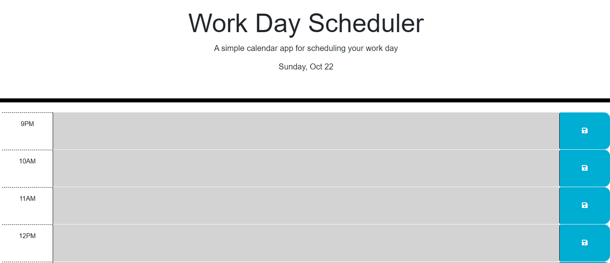

# Work Day Scheduler Starter Code

This is a basic planner for organizing a work day.
 I was provided with a basic structure for an hour block.
 This included sizing and color coordinating as well as other styling.
 Both QueryJS and DayJS were used to add functionality to the page.
 Blocks of hours will change color depending on whether they are past, present, or future.
 In addition, appointments can be saved to localStorage in the text boxes.
 When clicking the save icon, a confirmation message will appear and the saved items will load when the page is next opened.

[A link to the website can be found here.](https://anthonyrqqq.github.io/work-day-scheduler)